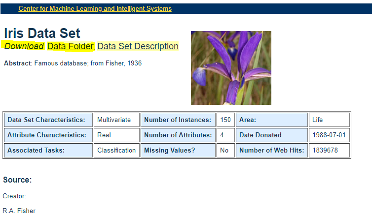
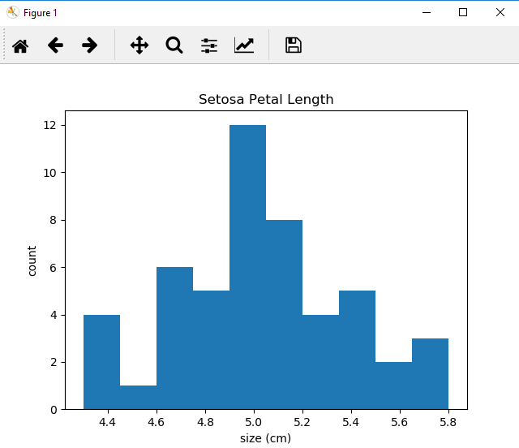

# Iris-Data-Set-Project

The Search For The Holy Grail
> ARTHUR: What manner of man are you that can summon up fire without flint or tinder?
>TIM: I... am an enchanter.
>ARTHUR: By what name are you known?
>TIM: There are some who call me... 'Tim'? 

## Hugh O'Reilly 01/04/2018
## Exploration of the Iris Data set using Python
## python files in this repository

* Irisdata_mean.py is an initial attempt to write simple functions on irisdata set as csv file
* Irisdata.py = a basic few lines of code to import csv file and sort into rows and column
* IrisData_np.py Main Python file worked on. Attempt to import pandas, numpy and matplotlib packages and work on data set

### 1.0 INTRODUCTION

#### 1.1 The Iris Data Set
   The iris data set was first described in a paper written by R.A. Fisher in the *Annals of Human Genetics* in 1936. It is a data set of 50 samples which the author gathered on each of three species of Irises: *setosa*, *versicolor* and *virginica*. Measurements of 4 properties of 50 flowers of each of the plants were taken, namely Sepal length, Sepal width, Petal Length, and Petal width. The author suggests that the petal and sepal lengths and widths are characteristics whcih can be used to identify which species they belong to based on a linear discriminant model. Fischer himself developed the linear discriminant model,a statistical, machine learning and pattern recognition technique used to distinguish between two or more objects, classes or events. Ref [Linear discriminant analysis] [https://en.wikipedia.org/wiki/Linear_discriminant_analysis]Ref [Iris Data set wikipedia] [https://en.wikipedia.org/wiki/Iris_flower_data_set]  Fischer presented the data for the 3 species in a table with each of the four measurements and subsequently, tables of observed means, sums of squares etc in order to demonstrate how each species can be discriminated from one another. Fischer first carries out an analysis of variance (ANOVA) of the data set, using sums of squares and products of deviations from each mean in order to create a linear function which best descriminates between the two species. The ANOVA test is a powerful statistical tool which, using the means between vaiables can determine the relationships (such as differences) between factors. Ref [The use of multiple measurements in taxonomic problems][http://rcs.chemometrics.ru/Tutorials/classification/Fisher.pdf], [Choosing and Using Statistics : A Biologist's Guide] [ Dytham, C. Choosing and Using Statistics : A Biologist's Guide, 2011, Wiley]

#### 1.2 Simple Python functions

   A simple function to calculate the mean of a column is seen here in irisdata_np.py
   

   Using the Numpy package has the 'mean' function built in so it can be seen in further work that writing a function to define the mean is not really necessary. 

#### 1.3 Python Packages

##### Numpy

   The NumPy package is a basic package for scientific computation in python. It is also particularly useful as a container for multidimensional data which makes NumPy arrays easy to work with,manipulate and analyse. This allows NumPy to seamlessly and speedily integrate with a wide variety of databases. Ref [NumPy][https://docs.scipy.org/doc/numpy/index.html] In our case the Iris data set is saved as a 'csv' file i.e. a comma separated values file. Microsoft Office's website ref [www.office.com]. [https://support.office.com/en-us/article/Import-or-export-text-txt-or-csv-files-5250ac4c-663c-47ce-937b-339e391393ba] defines CSV files as >"Comma separated values text files (.csv), in which the comma character (,) typically separates each field of text." CSV files are difficult to work with since the commas and other strings must be removed and the float and/or integer data must be then sorted and worked on. Numpy was found to be particularly useful for importing the data set as an array (matrix) or 'list of lists' on which various functions could be applied. Attempts were made in the IrisData_split.py file to write code which allowed the data set to be split without using the Numpy package. 

Example screenshot from Irisdata_split.py file
 

However it proved easier and more intuitive to subsequently use Numpy as in Iris_Data_np_v2.py. 

#### Matplotlib

   The Matplotlib python library is used to make charts such as histograms, plots and bar charts. The pyplot module is used in this project to generate simple histograms of the python data set for example in file 'Iris_data_np_v2.py'. Addition of add-on toolkits such as 3d plotting with mplot3d enhance the functionality of the matplotlib library. Ref [matplotlib] [https://matplotlib.org/]

#### Scikitlearn

Scikitlearn is a useful library for carrying out machine learning in python and contains many machine learning models which may be used to explore data sets. Scikitlearn already has built in code to handle the machine learning analysis of large data sets. ref [Grus, J.; Data Science from Scratch, 2017, O'Reilly] [http://scikit-learn.org/stable/tutorial/basic/tutorial.html]

   
### 2.0 EXPERIMENTAL

   
#### 2.1 Downloading and importing the Data Set

Repository File: Irisdata.py

   The file iris.csv in this repository contains the csv data for the iris data set. This was accessed from the UCI machine learning repository located at Ref: [UCI MACHINE LEARNING REPOSITORY][https://archive.ics.uci.edu/ml/datasets/iris] by simply downloading the folder containing the data set here:

   
   
   The data set is then saved as a csv file in the parent folder of this repository in a subfolder called 'data'.
   The file Irisdata.py in this repository was initially written to import the Iris Data set file, removing the commas from each line and sorting the data into neat rows and columns. The script then converts each line to a list and outputs the result to the screen.

   

#### 2.2 Plots and histograms of the Iris Data set

Repository File: Iris_Data_np_v2.py

  Plots and histograms of the Iris data set was carried out by first separating out the rows and columns of the data set into species and characteristic. Use of the data import, analysis and display properties of pandas, NumPy and Matplotlib respectively were used through trial and error to find the appropriate commands. 

An example of a histogram generated is displayed below, from the Iris_Data_np_v2.py file.

  
#### 2.3 Simple Statistical Analysis

  Simple calculations on the data set might involve getting the mean of each column i.e. looping through column 1 to 4, getting the sum of each column and dividing by the number of rows to get the mean. This loop would have to terminate at the strings in the data set. The file IrisData_mean.py uses pandas to import the csv file which is then converted to a Numpy array using the NumPy package. The file is then split easily by species and characteristic. Means are calculated for each characteristic; Sepal length, Sepal width, Petal Length,and Petal width for each species to three decimal places. 

From IrisData_mean.py python file

  

  Further work was carried out to calculate the standard deviation from the mean for each property.

  

  Determination of the means of each characteristic in the data set is the simplest and first step in data analysis of this or any set of data. The mean of each characteristic helps us give a (hopefully) unique numerical label to each characteristic with which we might distinguish it from other characteristics. The standard deviation from the mean helps us determine how our data set varies from the mean and gives us some initial anecdotal evidence as to how easy it might be to use the means to predict the species of Iris, given an unknown data set of measurements of characteristics, such as Petal length and width, and sepal length and width. 

#### 2.4 Machine Learning
  
  Machine learning may be defined as 'creating and using models that are learned from data' Typically the goal of machine learning is to take a data set whose relationships we understand  (a training set), use it to develop models which are then used to predict various outcomes for new, data. 
  A 'model' may be defined as "The specification of a mathematical (or probabilistic) relationship that exists between different vasriables".
    
  In the case of the Iris Data set investigated in this project the goal of a machine learning algorithm might be to predict the species of iris based on an unknown set of petal and sepal width and lengths (or even just the data from one measurement such as petal length.) 

##### 2.4.1 Models

  Different types of machine learning models exist including

  * *Supervised*
    Where the (training) data is labelled with the right answers: *e.g.* Classification or regression
  * *Unsupervised*
    Where the data set has no labels: *e.g.* Clustering
  * *semisupervised*
    some data are labelled
  * *Online*
    Where the model has to adapt continuously to new data

  Choosing the correct machine learning model for the data we have is an important choice in the process of data analysis. Such decisions may be to proceed with models such as linear regression where there is a linear relationship between parameters, polynomial regression, or decision trees, to name a few examples.
  [Ref] [Grus, J.; Data Science from Scratch, 2017, O'Reilly] [http://scikit-learn.org/stable/tutorial/basic/tutorial.html]

##### 2.4.2 Machine Learning carried out on Iris Data Set

The Scikitlearn library site contains various examples of machine learning models of the Iris data set including principal component analysis, logistic regression and nearest neighbours classification (amongst others) ref: [http://scikit-learn.org/stable/modules/generated/sklearn.datasets.load_iris.html]

   ### 3.0  DISCUSSION AND CONCLUSION

   ### REFERENCES
